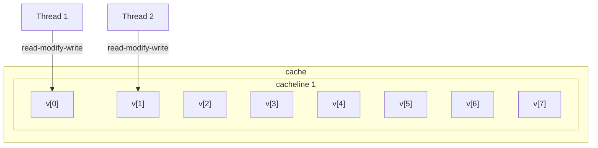

# Cache False Sharing

In this experiment we observe the phenomena of false sharing of caches. This usually happens when you have two or more threads modifying different elements that happen to be on the same cache line. This will make the separated threads wait on one another, and can have devastating results on performance.


In the figure below, Thread 1 and Thread 2 access different elements (v[0] and v[1], respectively). However, even without any data share, the threads will have to wait each other due to them falsely sharing the same cache line.



This effect is a lot more visible when using std::atomic. Atomic does read-modify-write operations, which forces other threads to wait while the operation is executing.

## How to avoid this?

To avoid this phenomena, it is necessary to make sure shared data never ends up in the same cache line. One possible solution is to use `alignas(n)` when defining a variable. This will make sure that the variable is always allocated in an address that is a multiple of `n`.

So, if the cache line has 64 bytes, then using `alignas(64)` will make sure each variable will be allocated on addresses multiple of 64. Which, will avoid variables ending up in the same cache line.

Another possibility is to use local variables in each thread, and only at the end of the calculation move the result to the shared variables.

## Results

Some results of our experiments, this tests counting until 100.000 using 4 threads and atomic variables.

* We can see that BM_FALSE_SHARING takes the longes to execute, because of the false sharing phenomena.

* For the sake of curiosity, we also test using regular variables (non-atomic), but we don't see any problems (NO_ATOMIC experiments).

* Finally, using local variables and `alignas(64)`, we eliminate the problem of false sharing.

```
-------------------------------------------------------------------------------
Benchmark                                     Time             CPU   Iterations
-------------------------------------------------------------------------------
BM_FALSE_SHARING/real_time                            1.84 ms        0.056 ms          378
BM_FALSE_SHARING_NO_ATOMIC/real_time                 0.030 ms        0.029 ms        22444
BM_FALSE_SHARING_NO_ATOMIC_LOCAL_VARS/real_time      0.030 ms        0.028 ms        22943
BM_LOCAL_VARIABLES/real_time                         0.466 ms        0.051 ms         1445
BM_NO_SHARING/real_time                              0.469 ms        0.053 ms         1384
```

### References

Many thanks to CoffeeBeforeArch [post](https://coffeebeforearch.github.io/2019/12/28/false-sharing-tutorial.html) for the explanation and examples.

Also thanks to the talk from Fedor Pikus on CppCon 2017 ([link](https://youtu.be/ZQFzMfHIxng?si=n2j7P782lwJ9jimn)).

